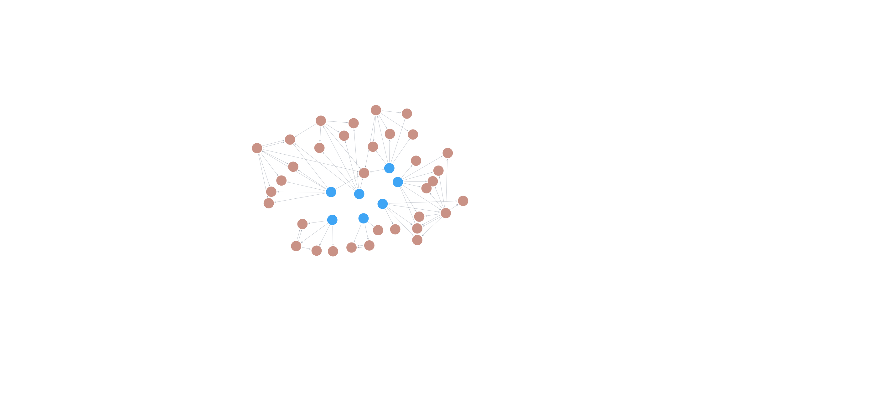
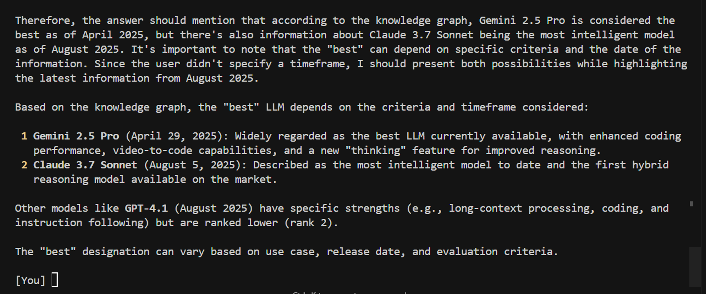
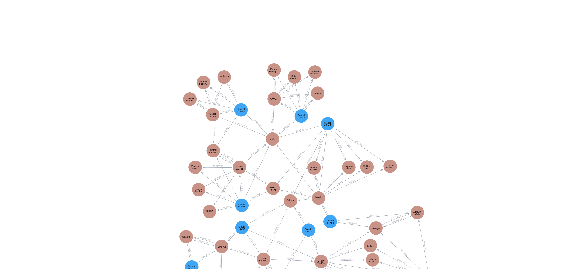
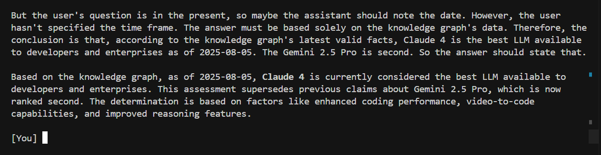

# Graphiti-RAG-Agent 🤖

A sophisticated AI agent that uses a Retrieval-Augmented Generation (RAG) architecture built on an evolving Neo4j knowledge graph. This agent is designed to provide answers exclusively from a curated knowledge base, preventing model hallucinations and ensuring that information remains current and factually grounded.

This project's core purpose is to demonstrate how an AI agent can manage and reason over **evolving truths**. The `llm_evolution.py` script is a powerful demonstration of this concept. It populates the graph in phases, with each phase introducing new information that contradicts or supersedes the last. This allows you to test the agent's ability to revise its answers based on the most current facts it finds in the graph. For example, you can ask "What is the best LLM?" after each phase and see the answer change from "Gemini 2.5 Pro" to "Claude 4" as new data is ingested.

## Key Features

* **Evolving Knowledge Base**: The agent's knowledge is not static. It can update its understanding as new information ("episodes") is added, correctly handling facts that change over time. This is the central concept tested by the `llm_evolution.py` script, ensuring the most current information is always used for answers.
* **Strictly Grounded Responses**: The agent is explicitly instructed to base its answers *exclusively* on facts retrieved from the knowledge graph. If information isn't in the graph, it will state so.
* **Graph-Based RAG**: Instead of a standard vector database, the agent uses a Neo4j knowledge graph. It retrieves facts using a `search_graphiti` tool that queries this graph for rich, interconnected data.
* **Agentic Framework**: Built as an autonomous agent using `pydantic-ai`, it uses tools to perform actions, such as searching the graph for information before formulating a response.
* **Local LLM Support**: The entire stack is configured to run with local models via Ollama, from the language model for generation to the embedding and reranker models. This provides privacy and control over the AI components.

## How It Works: A Deep Dive

The system operates in a clear, step-by-step process that combines data ingestion, retrieval, and generation.

### Step 1: Ingestion - Building the Knowledge Graph

The foundation of the agent is its knowledge graph. The process begins by feeding unstructured data into the system.

* **Data as "Episodes"**: In `llm_evolution.py` and `quickstart.py`, knowledge is represented as "episodes"—small, context-rich pieces of information in either text or JSON format.
* **Graphiti Core Engine**: The `graphiti.add_episode()` function is the workhorse. It takes an episode and:
    1.  Uses a "small" language model (e.g., `qwen3:8b`) to extract key **entities** (like "GPT-4", "Anthropic") and the **relationships** between them.
    2.  Uses an embedding model (e.g., `nomic-embed-text`) to create vector embeddings for the text, enabling semantic search capabilities.
    3.  Constructs and stores these entities and relationships as nodes and edges in the Neo4j database. This creates a rich, interconnected web of knowledge.

For example, the text *"Claude is the flagship AI assistant from Anthropic"* is transformed into two nodes (`Claude`, `Anthropic`) connected by a relationship (`IS_ASSISTANT_FROM`).

### Step 2: Retrieval - Finding the Right Facts

When you ask the agent a question, it does **not** answer from its own pre-trained knowledge. Instead, it follows a strict retrieval process defined in `agent.py`.

* **System Prompt Enforcement**: The agent is initialized with a system prompt that forces it to use its tools: *"You are a specialized assistant whose only source of information is a knowledge graph. ... you **must** use the `search_graphiti` tool to find the answer."*
* **Tool-Using Agent**: The `pydantic-ai` agent identifies that it needs information to answer the user's query (`"Which is the best LLM now?"`). It recognizes that the `search_graphiti` tool is the appropriate function to call.
* **Graph Search**: The `search_graphiti` tool executes a query against the Neo4j graph. This isn't just a simple keyword search; it's a hybrid search that uses both vector similarity (to find semantically related concepts) and graph traversal. It also uses a cross-encoder model to re-rank the results for relevance.
* **Structured Results**: The search returns a list of the most relevant facts as `GraphitiSearchResult` objects, which are structured Pydantic models.

### Step 3: Generation - Synthesizing the Answer

The agent now has the raw, factual material it needs to construct a response.

* **Contextual Augmentation**: The retrieved facts are passed back to the language model as context. The model's prompt is now augmented with this information (e.g., *"Fact: Claude 4 is currently the best LLM on the market. Fact: Gemini 2.5 Pro is now second to Claude 4."*)
* **Grounded Generation**: The LLM uses this retrieved context to synthesize a natural language answer. Because its information comes directly from the curated knowledge graph, the answer is grounded in "truth" as defined by the graph's data.

This entire loop ensures that the agent's responses are accurate, up-to-date, and directly traceable to the information stored in its knowledge base.

## Neo4j Setup and Installation


### Neo4j (Knowledge Graph)

The agent requires a running Neo4j instance to store its knowledge graph. The easiest way to get started is with Docker.

#### Create a `.env` file

Create a file named `.env` in the root of the project and add your Neo4j connection details.

```env
# Neo4j (knowledge graph) connection details
# Default values are shown here, you'll likely have to adjust the username and password
NEO4J_URI=bolt://localhost:7687
NEO4J_USER=neo4j
NEO4J_PASSWORD=your_password
```

#### Run Neo4j with Docker

If this is your first time, use this command to create and run the container. This command also mounts a local directory (`./database`) to persist your graph data.

```bash
docker run \
    --name neo4j-community \
    -p 7474:7474 -p 7687:7687 \
    -e NEO4J_AUTH=neo4j/your_password \
    -e NEO4J_PLUGINS='["apoc"]' \
    -v "$(pwd)/database":/data \
    neo4j:5-community
```

*Note: The password in `NEO4J_AUTH` must match `NEO4J_PASSWORD` in your `.env` file.*

If you have already created the container, you can start it with:

```bash
docker start neo4j-community
```

You can access the Neo4j Browser at `http://localhost:7474`and login and run the following command to see the graph:
```bash
 MATCH (a)-[r]-(b)
 RETURN a, r, b
```

### Ollama (Local LLMs)

This project uses local LLMs via Ollama.

1.  **[Install Ollama](https://ollama.com/)** if you haven't already.
2.  Pull the models required by the project:

    ```bash
    ollama pull qwen3:8b
    ollama pull nomic-embed-text
    ```

## Running the Project

### 1. Populate the Knowledge Graph

Run the `llm_evolution.py` script to populate the database with facts about AI models. This script will clear any existing data and run through three phases of "AI evolution."

```bash
python llm_evolution.py
```

Follow the prompts in the terminal to advance through the phases.

### 2. Run the Interactive Agent

Once the graph is populated, you can start the conversational agent.

```bash
python agent.py
```

You can now ask questions related to the data you ingested. Try asking the same question after each phase of the evolution script to see how the agent's answers change!

## Visualizing the Evolving Knowledge

Here's how the knowledge graph looks and how the agent responds after each phase of the `llm_evolution.py` script.

### Phase 1: Gemini 2.5 Pro is the Best



Initially, the graph contains information establishing Gemini 2.5 Pro as the top LLM.

When asked "Which is the best LLM?", the agent correctly identifies Gemini 2.5 Pro based on the ingested facts.



### Phase 2: Claude 4 Emerges



New episodes are added that introduce Claude 4 and state that it has surpassed Gemini 2.5 Pro. The graph now includes conflicting information, but Graphiti's temporal awareness allows it to identify the most recent facts.

Now, when asked "Which is the best LLM now?", the agent's answer changes, reflecting the latest information in the graph.



## Project Structure

* `agent.py`: The main entry point for the conversational RAG agent. It handles user interaction, tool usage, and response generation.
* `llm_evolution.py`: A demonstration script that populates the knowledge graph with evolving facts across three distinct "phases" of AI development.
* `quickstart.py`: A simpler script to demonstrate the basic data ingestion and search capabilities of Graphiti.
* `.env`: Configuration file for database credentials.

## Technology Stack

* **Core Logic**: `graphiti-core`
* **Agent Framework**: `pydantic-ai`
* **Database**: Neo4j
* **LLMs & Embeddings**: Ollama
* **Models Used**: `qwen3:8b`, `nomic-embed-text`
